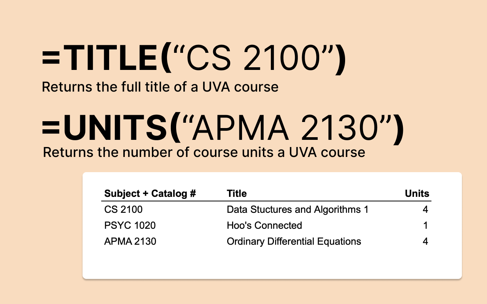

    

---
<h1 align="center">
    UVA SIS Automator + Degree Plan Templates
</h1>

Automate both the process of building and getting data for you degree plan at the University of Virginia (UVA). Planning is great, but UVA's [student information system](https://in.virginia.edu/sis) planning features are quite terrible.

This project creates:
- **a Google Sheets Add-On** to pull course information (e.g. title, instructors, units, etc.) from a course pneumonic (e.g. CS 2100, PSYC 1020, etc.)
- **templates for common degree plans** built with connectors
> Currently, only B.S. Computer Science, but planning to expand

# Check it out!

The website is currently live at [uvamisc.com](https://uvamisc.com).

➡️ <strong><a href="https://uvamisc.com" alt="UVA Misc">Click me to go to the website</a></strong>⬅️

# Contributing

Building the scraper was a near-pedagogical project of mine to learn Firebase and Cloud Functions. Likewise, I am guaranteed to have made mistakes and simple omissions. Submit a feature request or contact me for any and all suggestions.
